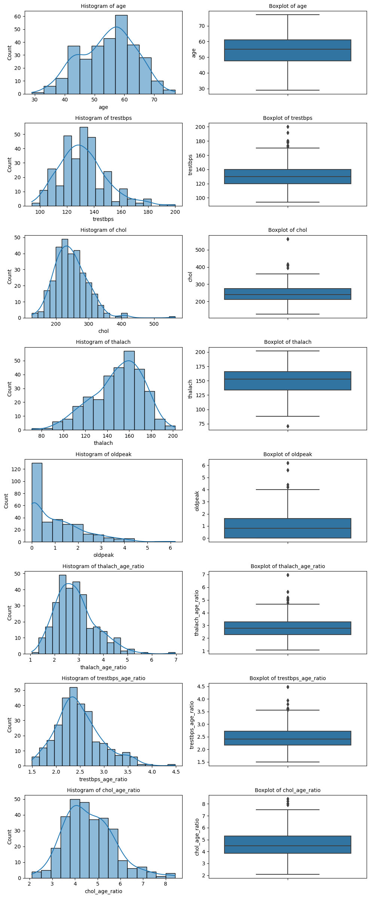
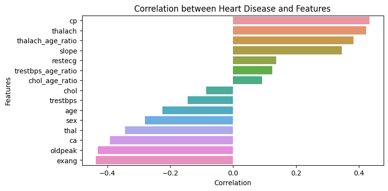
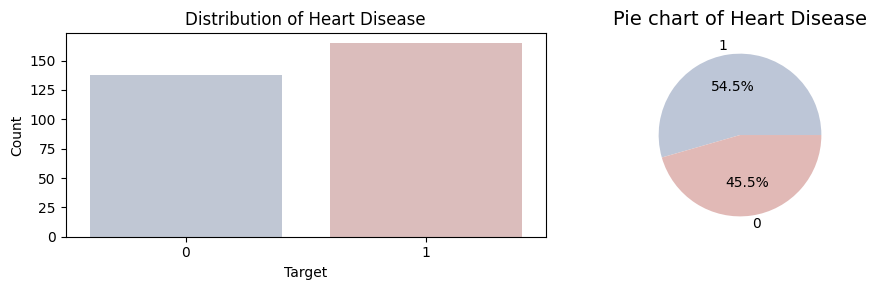
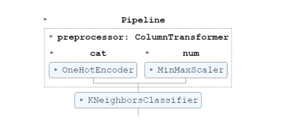

# Heart Disease Analysis and Prediction Model

This project focuses on analyzing and predicting heart disease using a dataset sourced from [Kaggle](https://www.kaggle.com/datasets/krishujeniya/heart-diseae).

## Dataset Overview
The dataset contains 303 records and the following features:

- **age**: Age of the patient (in years)
- **sex**: Sex of the patient (1 = male, 0 = female)
- **cp**: Chest pain type (1-4)
- **trestbps**: Resting blood pressure (in mm Hg on admission to the hospital)
- **chol**: Serum cholesterol in mg/dl
- **fbs**: Fasting blood sugar > 120 mg/dl (1 = true; 0 = false)
- **restecg**: Resting electrocardiographic results (0-2)
- **thalach**: Maximum heart rate achieved
- **exang**: Exercise-induced angina (1 = yes; 0 = no)
- **oldpeak**: ST depression induced by exercise relative to rest
- **slope**: Slope of the peak exercise ST segment
- **ca**: Number of major vessels (0-3) colored by fluoroscopy
- **thal**: Thalassemia (3 = normal; 6 = fixed defect; 7 = reversible defect)
- **target**: Presence of heart disease (1 = yes, 0 = no)

Total Records: **303**

## Workflow

### 1. Preprocessing
- **Missing Values**:
  - No missing values in the dataset.

- **Checking Data Types**:
  - All data types are either integers or floats; no further processing required.

  ```plaintext
  RangeIndex: 303 entries, 0 to 302
  Data columns (total 14 columns):
  #   Column    Non-Null Count  Dtype
  ---  ------    --------------  -----
  0   age       303 non-null    int64
  1   sex       303 non-null    int64
  2   cp        303 non-null    int64
  3   trestbps  303 non-null    int64
  4   chol      303 non-null    int64
  5   fbs       303 non-null    int64
  6   restecg   303 non-null    int64
  7   thalach   303 non-null    int64
  8   exang     303 non-null    int64
  9   oldpeak   303 non-null    float64
  10  slope     303 non-null    int64
  11  ca        303 non-null    int64
  12  thal      303 non-null    int64
  13  target    303 non-null    int64
  dtypes: float64(1), int64(13)


### 2. Data Visualisation
  
  

### 3. Outliers
  - Identified Outliers in numerical features
  - Determined to keep the outlier

     ```plaintext
    Outliers in 'age':
    age  sex  cp  trestbps  chol  fbs  restecg  thalach  exang  oldpeak  slope  ca  thal  target
    72   29   1   1        130    204  0        0        202    0        0.0    2    0    2     1
    129  74   0   1        120    269  0        0        121    1        0.2    2    1    2     1
    144  76   0   2        140    197  0        2        116    0        1.1    1    0    2     1
    238  77   1   0        125    304  0        0        162    1        0.0    2    3    2     0

    Outliers in 'trestbps':
    age  sex  cp  trestbps  chol  fbs  restecg  thalach  exang  oldpeak  slope  ca  thal  target
    71   51   1   2        94     227  0        1        154    1        0.0    2    1    3     1
    124  39   0   2        94     199  0        1        179    0        0.0    2    0    2     1
    223  56   0   0        200    288  1        0        133    1        4.0    0    2    3     0
    248  54   1   1        192    283  0        0        195    0        0.0    2    1    3     0

### 4. Correlation Analysis
  - **Features and Target Correlation**
   

### 5. Target Distribution
- **Balanced Target Distribution**
  

### 6. Model Building
- **Scaling, Normalizing, Train-Test Split and Grid Search**
-  ```plaintext
    Best Parameters: {'classifier': KNeighborsClassifier(), 'classifier__n_neighbors': 5, 'preprocessor__num': Pipeline(steps=[('scaler', MinMaxScaler())])}
    Best Cross-Validation Score: 0.8683673469387756
    Test Set Score: 0.819672131147541

  **Feature Importance**
   ```plaintext
    thal: 0.080 ± 0.031
```
### 7. Final Pipeline

